# GISO 管理控制台 · 产品介绍

> v1.0.1 · 管理台 v2 · 测试环境示例截图  
> 入口：`https://gamelinelab-giso.envir.dev/admin/`（内网 / VPN）· 本地：`http://localhost:8123/admin/`

GISO 管理控制台与接入网关同进程部署，覆盖 **登记 → 联调 → 审批 → 质量监控 → 平台治理** 全链路。本文用界面截图说明各模块能力。

---

## 1. 产品导航（GIDO 数据产品族）

Gateway 根路径 `/` 提供一键跳转：ClickHouse 分析线、Doris 数仓线、资讯 Web Demo、管理控制台、大同对比评审等。


| 入口 | 说明 |
|------|------|
| `/admin/` | 埋点治理管理台（本文主体） |
| `/admin/datong-gap.html` | GISO vs 腾讯大同能力对齐矩阵 |
| Metabase | 预置「GISO 埋点总览」看板（Compose 栈内） |

---

## 2. 控制台布局

```
┌──────────────────────────────────────────────────────────────┐
│ 顶栏：GIDO 徽标 · 实时联调状态 · 接入助手 · 平台/更多 · 空间 · 用户 │
├──────────┬───────────────────────────────────────────────────┤
│ 侧栏     │  主内容区（实时联调 / 注册表 / 统计 …）              │
│ · 联调   │                                                   │
│ · 断言   │                                                   │
│ · 注册表 │                                                   │
│ · 待审批 │                                                   │
│ · 质量   │                                                   │
└──────────┴───────────────────────────────────────────────────┘
```

- **侧栏 5 项**：日常接入最常用能力，一屏可达。
- **顶栏平台菜单**：空间管理、账号管理、系统设置（平台管理员）。
- **顶栏更多**：产品导航、大同对比评审。
- **空间选择器**：GIDO 风格下拉，切换 `default` / `longvideo` / `sports` 等工作空间。

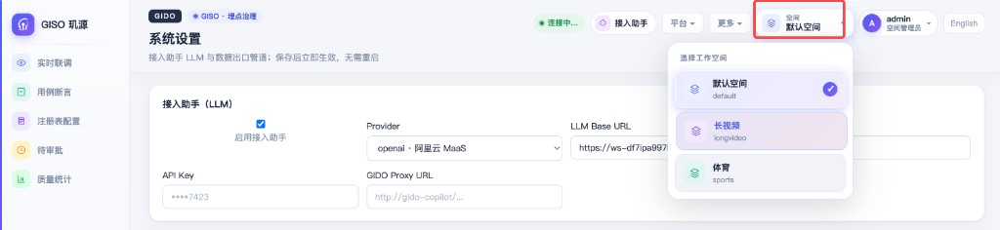

支持 **中 / 英** 界面切换（顶栏「English / 中文」）。

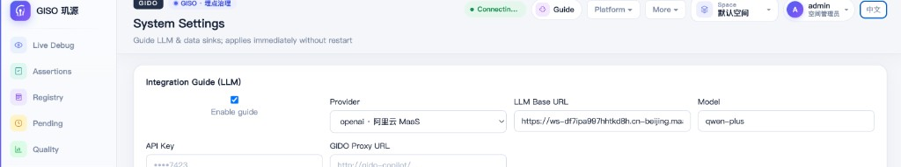

---

## 3. 实时联调

设备 SDK 开 `debug: true` 后，事件经 `POST /v1/track` 进入网关；管理台通过 **SSE** 按当前空间实时推送校验结果。

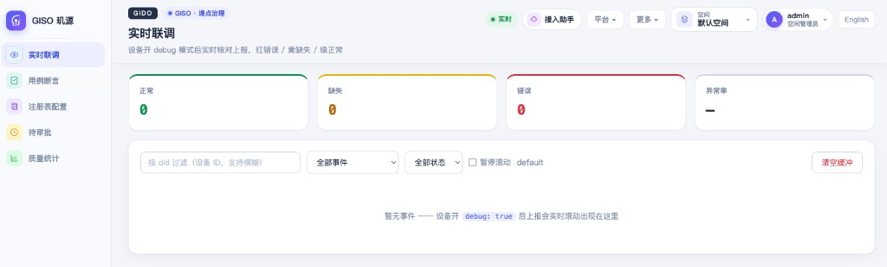

| 元素 | 说明 |
|------|------|
| 绿 / 黄 / 红计数 | ok / missing / error 三分类 + 异常率 |
| did 过滤 | 按设备 ID 模糊匹配，只看自己的包 |
| 事件 / 状态筛选 | 快速定位某类问题 |
| 暂停滚动 | 冻结列表便于截图或核对 JSON |

> 联调提示：测试环境 Gateway 多副本时，SSE 与内存缓冲可能落在不同 Pod；联调期间建议 1 副本或配置 sticky session。详见 [08-FAQ Q21d](08-接入常见问题FAQ.md)。

---

## 4. 注册表配置

按 **当前空间** 隔离的四池登记：参数池、页面池、元素池、业务事件。数据持久化在 **PostgreSQL**，revision 与条目数实时展示。

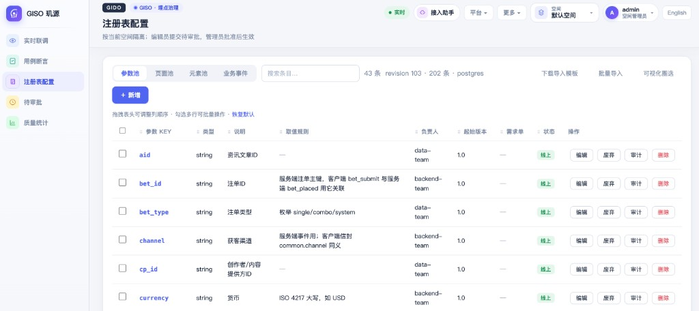

| 能力 | 说明 |
|------|------|
| CRUD | 新增 / 编辑 / 废弃 / 删除 / 审计 |
| 批量操作 | 全选本页 → 批量提交审批 / 批准 / 发布 / 废弃 / 删除 |
| CSV 导入 | 下载模板 → 批量导入 → 编辑员提交待审批 |
| 可视化圈选 | 跳转 Visual Picker，在截图上框选元素生成 draft |
| 列拖拽 | 表头拖拽调整列顺序，偏好存 localStorage |
| Tab 切换 | 客户端缓存，切换池类型无需重复拉全量 API |

编辑员提交后进入 **待审批**；管理员批准后变为 `live`，参与线上校验。

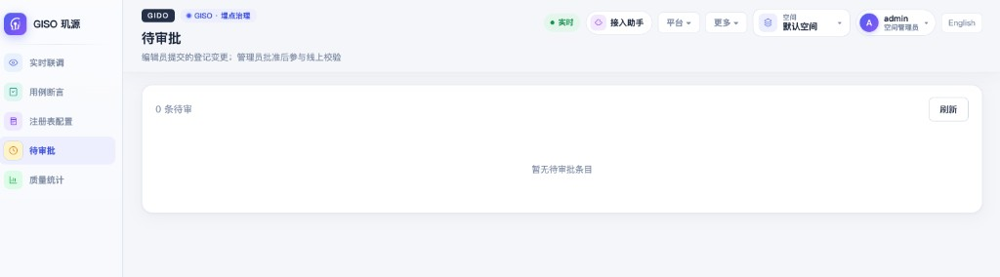

---

## 5. 质量统计

三维度质量报表，支撑发版回归与灰度监控：

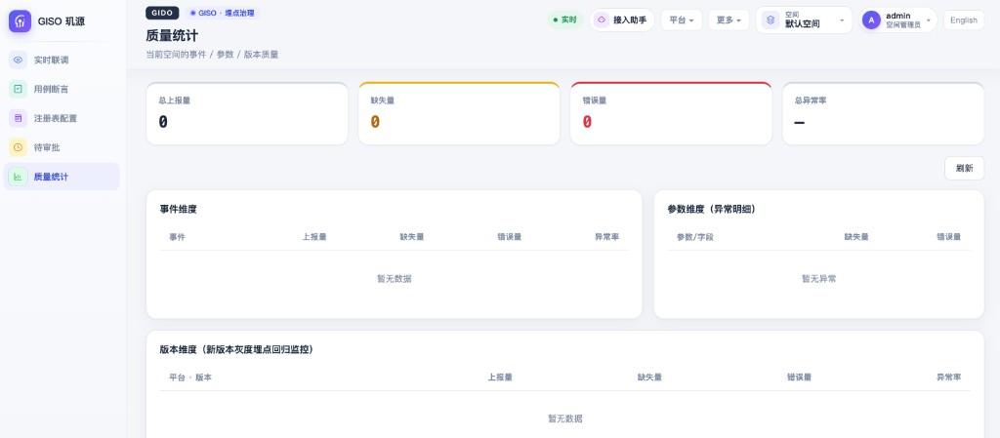

| 维度 | 用途 |
|------|------|
| 事件维度 | 各 event + pgid/eid/code 的上报量与异常率 |
| 参数维度 | 缺失 / 错误参数字段明细 |
| 版本维度 | 按 `platform · app_vrsn` 看新版本灰度埋点质量 |

---

## 6. 接入助手（Copilot）

顶栏 **接入助手**：基于 FAQ 文档语料 + 可选 LLM（阿里云 MaaS 等），解答上报流程、App Key、隔离区、空间、注册表等问题。


- 默认 **doc** 模式无需 Key；生产可切 `openai` provider。
- 预置快捷问题芯片，一键发起对话。
- 详见 [12-Copilot](12-Copilot.md)。

---

## 7. 平台治理（顶栏 · 平台）

### 7.1 空间管理

创建空间、本空间成员与角色、App Key 绑定。上报时 `X-App-Key` 解析到对应空间并写入 `common.space`。

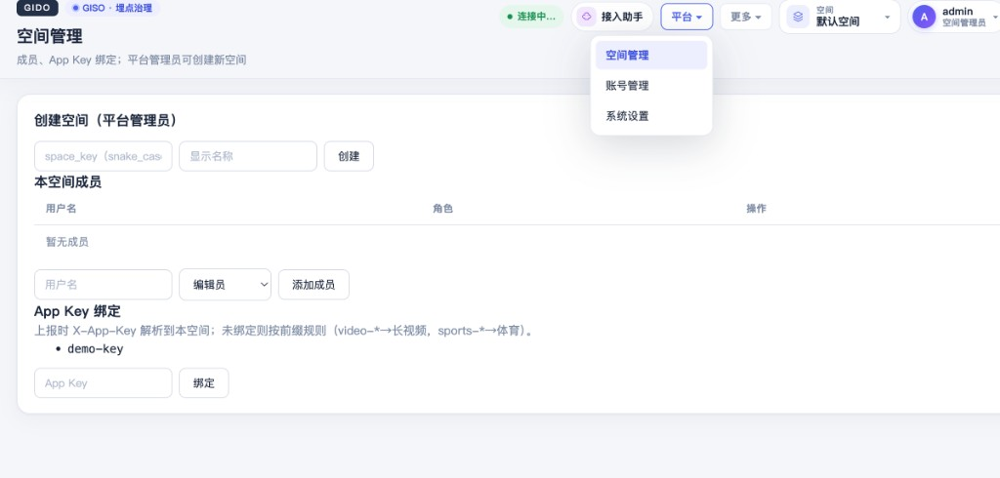

| App Key 前缀 | 默认空间 |
|--------------|----------|
| `video-*` / `longvideo-*` | longvideo |
| `sport-*` / `sports-*` | sports |
| 其他 / 显式绑定 | default 或绑定值 |

详见 [10-空间与多租户](10-空间与多租户.md)。

### 7.2 账号管理

平台级账号（PostgreSQL）：`system_admin` / `user`；空间内另有 space_admin / editor / viewer。

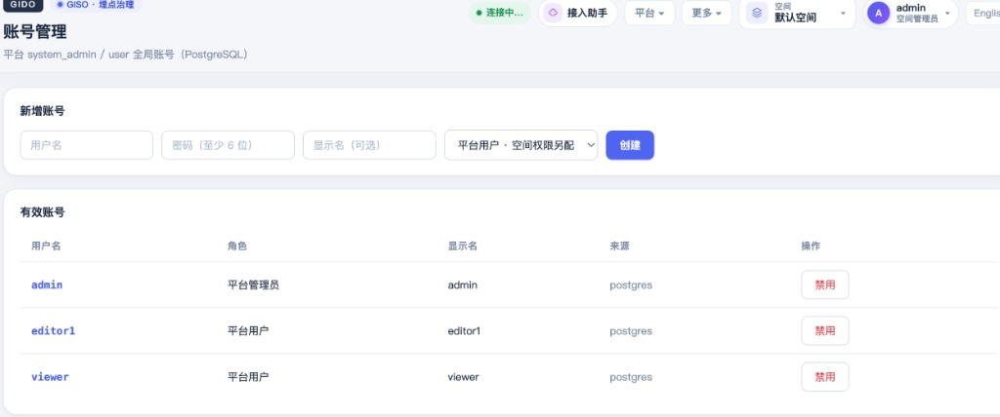

详见 [09-账号与权限体系](09-账号与权限体系.md)。

### 7.3 系统设置

接入助手 LLM 与 **数据出口管道** 可视化切换，保存后立即生效、无需重启 Gateway。

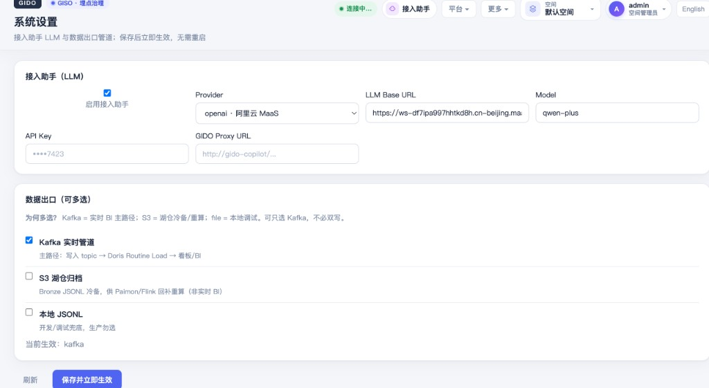

| 出口 | 说明 |
|------|------|
| Kafka | 主路径 → Doris Routine Load / BI |
| S3 | Bronze JSONL 湖仓归档（Paimon/Flink 回放） |
| file | 本地 JSONL，仅开发调试 |

顶栏 **更多** 菜单可跳转产品导航与大同对比页。

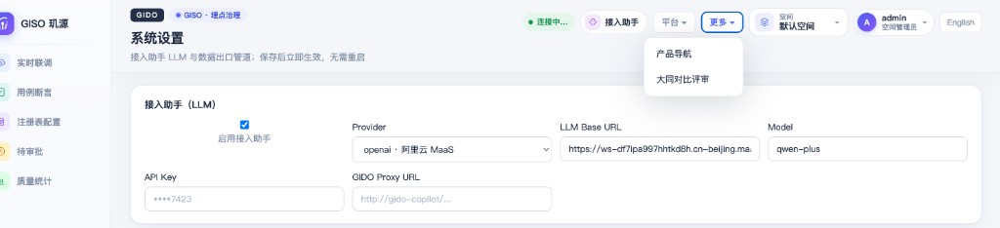

---

## 8. 典型工作流

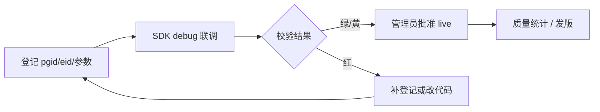

1. **编辑员** → 注册表新增（pending）或 CSV 导入  
2. **开发** → SDK `debug: true`，实时联调按 did 过滤  
3. **管理员** → 待审批批准 / 发布 live  
4. **测试** → 用例断言 API 固化期望序列  
5. **发版** → 质量统计看版本维度异常率  

---

## 9. 相关文档

| 文档 | 内容 |
|------|------|
| [06-接入指南](06-接入指南.md) | 业务方六步接入 |
| [08-接入常见问题FAQ](08-接入常见问题FAQ.md) | App 对接 QA |
| [09-账号与权限体系](09-账号与权限体系.md) | 登录与角色 |
| [10-空间与多租户](10-空间与多租户.md) | 空间与 SSE |
| [12-Copilot](12-Copilot.md) | 接入助手配置 |
| [00-开源产品全景方案](00-开源产品全景方案.md) | 架构与路线图 |
